# AWS Data Cataloguing

## Cataloguing Data in AWS Using Glue Crawlers: A Practical Guide for Data Engineers

### Introduction

In modern data engineering, one of the most overlooked but powerful capabilities is data cataloguing. Without a clear understanding of what data exists, where it lives, its schema, and how it changes over time, no ETL architecture can scale. In this guide, I walk through how to catalogue data using AWS Glue Crawlers, and how to structure your metadata layer when working with raw and cleaned datasets stored in Amazon S3.

This tutorial uses a simple CSV file in an S3 raw bucket and walks through how AWS Glue automatically discovers its structure and builds a searchable, query-ready data catalog. You can replicate every step through your AWS Console and include screenshots to transform this into a visual, practical learning resource.


##  What is Data Cataloguing?

Data cataloguing is the process of creating a structured inventory of all your data assets.

**A good data catalog contains:**

- Dataset name
- Schema (columns, data types, partitions)
- Location (e.g., S3 path)
- Metadata (size, owner, last updated)
- Tags, classifications, lineage

Think of it as the "index" of your data ecosystem - similar to how a library catalog helps readers find books quickly.

**Why it matters:**

- Makes data discoverable across teams
- Reduces manual documentation
- Ensures schema consistency across pipelines
- Enables data validation and quality checks
- Fuels self-service analytics
- Supports governance and compliance


## Data Cataloguing in ETL Pipelines

ETL pipelines depend heavily on metadata. Before transforming any dataset, the pipeline must understand:

- What columns exist
- Which data types to enforce
- What partitions to use
- What schema evolution has happened
- How to map raw → cleaned → curated layers

**A strong data catalog ensures that:**

- ETL jobs run reliably
- Glue/Spark scripts do not break due to schema drift
- Downstream BI tools (Athena, QuickSight, Superset, Power BI) can read data instantly
- Data lineage and documentation stay updated

AWS Glue Data Catalog acts as the central metadata store for all your structured and semi-structured data.


## Architecture Overview

Below is the structure you'll demonstrate in your article:

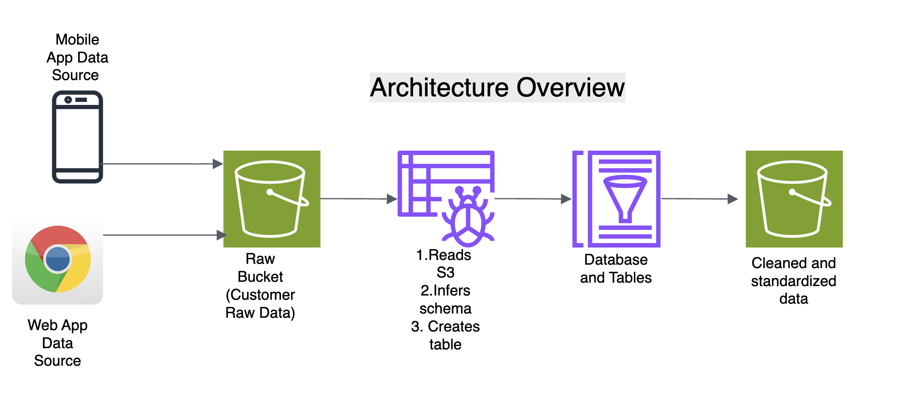


The project walkthrough will show how Glue Crawlers:

- Scan an S3 bucket
- Detect the schema (headers, types, formatting)
- Generate metadata
- Store the metadata as a table in the Data Catalog

This metadata is then queryable through Amazon Athena, interoperable with Glue ETL Jobs, and usable by analytics tools.

## Understanding Amazon S3, AWS Glue Crawler, and the Glue Data Catalog

### **Amazon S3 (Simple Storage Service)**
Amazon S3 is a fully managed object storage service that allows you to store any type of data at scale—CSV files, logs, JSON, Parquet, images, and more.  
It is highly durable, cost-effective, and integrates seamlessly with AWS analytics services. In most modern data engineering architectures (including the Medallion architecture), S3 serves as the **landing**, **raw**, and **processed** layers where data is ingested and stored before further transformation.

### **AWS Glue Crawler**
An AWS Glue Crawler is an automated metadata discovery tool that scans data stored in Amazon S3 and other sources.  
When the crawler runs, it:
- Reads the file structure and content  
- Detects the data format (CSV, JSON, Parquet, etc.)  
- Infers column names and data types  
- Identifies partitions  
- Classifies datasets using built-in or custom classifiers  

The crawler then automatically creates or updates table metadata without you having to define schemas manually.

### **AWS Glue Data Catalog**
The Glue Data Catalog is a centralized metadata repository for all your datasets within AWS.  
It stores:
- Table definitions  
- Schema information  
- Partition details  
- Metadata used by analytics services  

When the Glue Crawler finishes scanning an S3 bucket, it writes the discovered schema and table information into the Glue Data Catalog.  
This metadata can then be queried by services such as **Athena**, **EMR**, **Redshift Spectrum**, and **AWS Glue ETL** jobs.

In short, the workflow is:
**S3 → Glue Crawler scans files → Schema is inferred → Metadata is stored in Glue Data Catalog → Data becomes queryable.**


## Step-by-Step Workflow

Below is the structure you'll follow in your Medium/LinkedIn article when documenting your implementation with screenshots.

### 1. Upload Your CSV File to Amazon S3

- Create an S3 bucket named: `medallion-orders-2025-12-17`  **(Replace with your bucket name)**

```bash
# Create an S3 bucket (basic settings)
aws s3api create-bucket --bucket medallion-orders-2025-12-17 --region us-east-1
```

- Upload your sample CSV file (e.g., `orders.csv`)  
```bash
# Upload the CSV file to the bucket
aws s3 cp orders.csv s3://medallion-orders-2025-12-17/
```

```bash
# Upload to a folder (prefix)
aws s3 cp orders.csv s3://medallion-orders-2025-12-17/raw/orders.csv
```

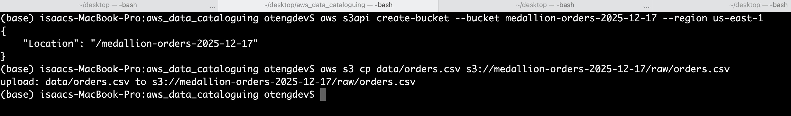

### 2. Create a Glue Database

In the Glue Console:

- Go to **Data Catalog → Databases**

- Click **Add database**

  
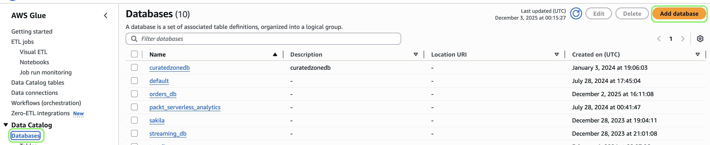


- Name it `orders_db` and click on **Create database**

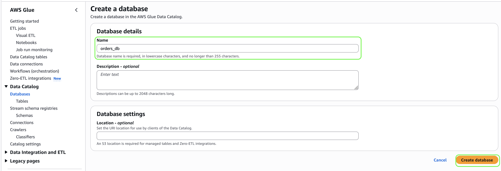


### 3. Create an AWS Glue Crawler

- Navigate to **Glue → Crawlers**
- Click on **Create crawler**
- Provide a name (e.g., `orders_crawler`) and click **Next**

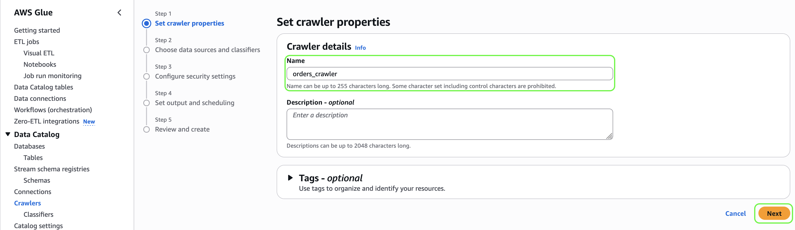
- Click on  **Add a data source**

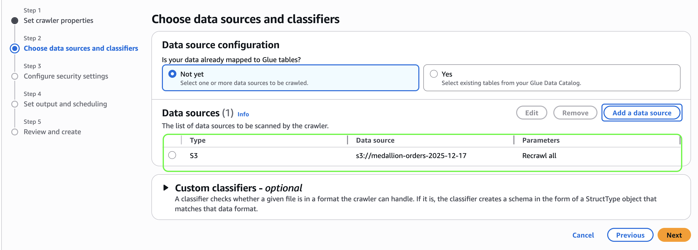
- Choose **S3** as the data store and Click on  **Browse S3** to select the S3 bucket


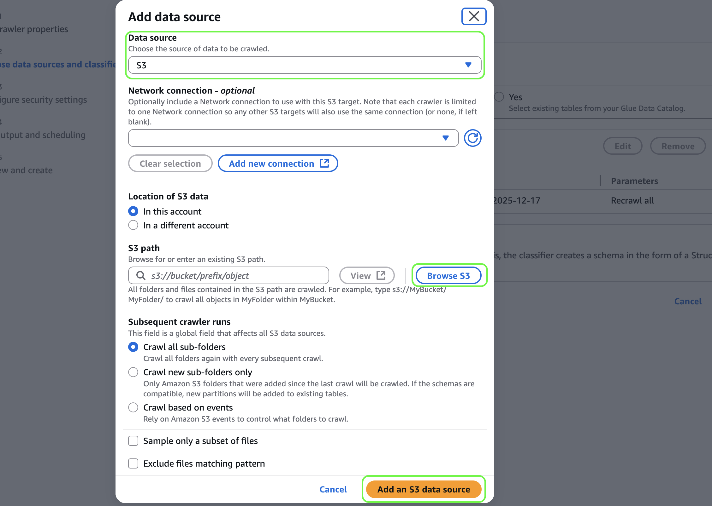

- On the next screen, choose a role (Glue created role or custom IAM role) Click **Next**


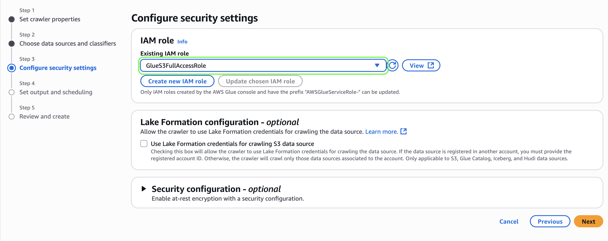
- Select your database. For Crawler schedule **On demand** and click **Next**  then **Create crawler**.


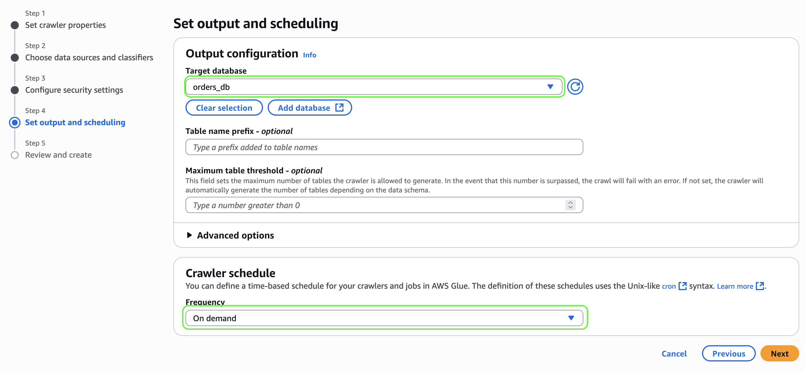
- **Run the crawler** and wait until status shows **complete**


### 4. Run the Crawler & Generate Metadata


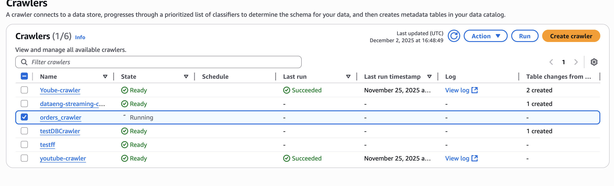

Once the crawler completes:

- It will create a table inside your Glue Data Catalog database
- Open the table to view:
  - Columns
  - Data types
  - S3 location
  - Classification (csv)

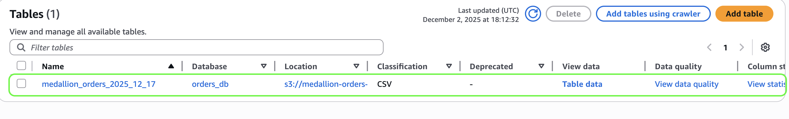

### 5. Query the Table Using Amazon Athena

- Open Athena
- Select your Glue database
- Run a simple `SELECT * FROM table LIMIT 10;`
- **(Insert screenshot of results)**


## Final Outcome

After completing the steps, you will have:

- A fully indexed representation of your raw data
- A searchable table in Glue Data Catalog
- A metadata-driven foundation for ETL jobs
- A structure ready for transformation into a cleaned bucket and eventually a curated analytics layer

This sets the stage for your next Medium article:

**"Building ETL pipelines using Glue ETL Jobs and writing cleaned data back into S3."**


## Conclusion

Data cataloguing is a foundational step in any scalable data engineering architecture. AWS Glue Crawlers make it easy to automate metadata extraction from raw data sources, reduce manual schema definition, and keep your ETL pipelines schema-aware and resilient.

By the end of this project, you'll have a practical, AWS-native setup that you can build on for data cleaning, transformations, and analytical workloads.